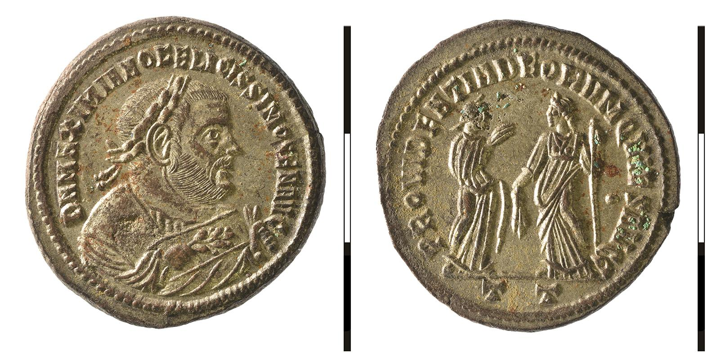
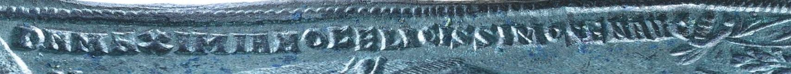

# OCR-ancient-coin-legend-recognition
`OCR` `Reading coin legends` `OCR evaluation metrics` 
## 1. What is it for？
The aim here is to recognize the legends on coins from the ancient Roman Imperial period which includes the obverse and reverse legends as well as the mint mark on the bottom of reverse. Also, metrics to evaluate the recognition results have been given.

## 2. How to make it work?
 Code here consists of three main steps:

### Step-1 Stitch the obverse and reverse coin pictures on one picture as input.
* Run `stitch_two_images.py` file in `OCR_preprocessing` folder. Then, you could get the image, for example, below:

 
### Step-2 Preprocess the images and save them for OCR.
* Run `test_one_image.py` file or `test_many_images` file in `OCR_preprocessing` folder.
* After this step, you could get all processed images (Strip images) and save them in the corresponding folders separately in `Coin_Samples`. They will be used in next step of OCR.
  - Example of processed image (Strip image): 
 
 
 
* The adopted algorithm is placed in `Algorithm`. For more detailed information, please refer to: [Algorithm](https://github.com/GreenIron/Recoinition "link for detailed algorithm")
 
 ### Step-3 Do OCR and the error evaluation metrics.
 * Highly recommended to open `OCR_Metrics_CER_WER_Colab` in `Jupyter Notebook`.
 * :bangbang: Since the some coins do not have the mint mark part. So the reference text(*ref_txt) is empty. However, in the process of calculating the error rate(CER and WER), the reference text cannot be empty, otherwise an error will be reported. Therefore, the blank reference text in excel should be deleted before performing OCR.
 * In this step, it allows to get the OCR results and re-evaluate the algorithm used (filter) for preprocessing in Step-2.
 * Since there are many factors that affect the results. In order to improve the recognition accuracy, here, we test the following two factors and compare their results.
   - Page segmentation mode (psg) provided by Pytesseract itself.
      * test with psg = 6/7/8/10 respectively.
   - Language package used.
      * test with the original Latin language package provided by `Pytesseract`. Download it from here [Lain Language](https://github.com/tesseract-ocr/tessdata "link for downloading Latin language package") and store it under `tessdata` folder in your `Pytesserat` .
      * test with custom Latin language package. The method to add the custom language package, see: [Method to add custom language](https://vovaprivalov.medium.com/tesseract-ocr-tips-custom-dictionary-to-improve-ocr-d2b9cd17850b "link for adding custom language")
   
 ## 3. Environments and packages used
 * Step-1 and step-2 in `Python`:
   - [ ] Open CV
   - [ ] scki-image
   - [ ] tensorflow
 
 * Step-3 in `Juyter Notebook`:
   - [ ] Openpyxl
   - [ ] Pytessract: Version 4.0 or higher
   - [ ] Fastwer: install in this way: [Fastwer installation method](https://github.com/kahne/fastwer "link for installing Fastwer")

## 4. What to do to improve the recognition accuracy in the future?
* Change the filtering parameters in `Algorithm`.
* Cut and extract samples of each letter and train them to form a new language package.

 
 
 
 
